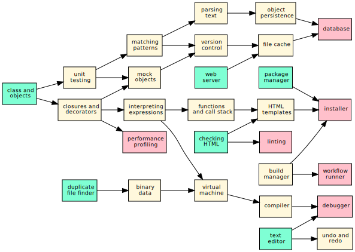

# Software Design by Example

Most data scientists have taught themselves most of what they know
about programming.  As a result, many have gaps in their knowledge:
they may be experts in some areas, but don't even know what they don't
know about others.

One of those other areas is software design.  A large program is not
just a dozen short programs stacked on top of each other: doubling the
size of a program more than doubles its complexity.  Since our brains
can only hold a small number of things at once, making large programs
comprehensible, testable, shareable, and maintainable requires more
than using functions and sensible variable names: it requires design.

The best way to learn design in any field is to study examples.  These
lessons therefore build small versions of tools that programmers use
every day to show how experienced software designers think.  Along the
way, they introduce some fundamental ideas in computer science that
most data scientists haven't encountered.  Finally, we hope that if
you know how programming tools work, you'll be more likely to use them
and better able to use them well.

