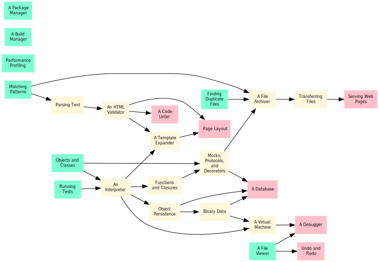

# Software Design by Example with Python

The best way to learn design in any field
is to study examples.
These lessons therefore build small versions
of tools that programmers use every day
to show how experienced software designers think.
Along the way,
they introduce some fundamental ideas in computer science
that many self-taught programmers haven't encountered.
Finally,
we hope that if you know how programming tools work,
you'll be more likely to use them
and better able to use them well.

## Audience

> **Maya** has a master's degree in genomics.
> She knows enough Python to analyze data from her experiments,
> but is struggling to write code that other people (including her future self) can use.
> These lessons will teach her how to design, build, and test large programs
> in less time and with less pain.

> **Yim** teaches two college courses on web programming.
> They are frustrated that so many books talk about details but not about design
> and use examples that their students can't relate to.
> This material will give them material they can use in class
> and starting points for course projects.

## Status

See [#152](/../../issues/152) for current status of August 2023 beta release.

